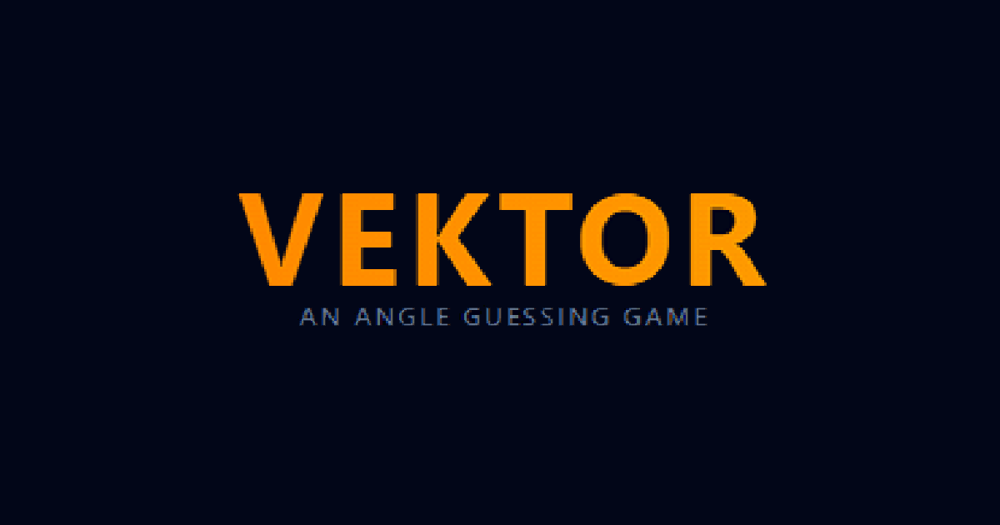

# 📐 VEKTOR — A Daily Vector Angle Guessing Game

**VEKTOR** is a clean, minimalist web game where players try to guess a daily target angle between 1° and 359°. Built with a highly responsive React/Vite frontend and powered by a serverless Python backend on Azure, it demonstrates a robust, automated multi-environment cloud lifecycle.

🔗 **Live Production App:**

<table>
  <tr>
    <td style="background-color: #0f172a; border: 1px solid #1e293b; border-bottom: none; border-radius: 8px 8px 0 0; padding: 10px 16px; user-select: none;">
      <span style="color: #ef4444; font-size: 14px;">●</span> 
      <span style="color: #f59e0b; font-size: 14px;">●</span> 
      <span style="color: #10b981; font-size: 14px;">●</span> 
      <span style="font-family: monospace; color: #94a3b8; margin-left: 12px; font-size: 13px;">https://www.vektor.wtf</span>
    </td>
  </tr>
  <tr>
    <td style="border: 1px solid #1e293b; padding: 0; background-color: #020617; border-radius: 0 0 8px 8px; overflow: hidden;">
      <a href="https://www.vektor.wtf" target="_blank">
        
      </a>
    </td>
  </tr>
</table>

## 🛠️ Architecture Overview

The application is cleanly divided into decoupled client and server environments, enabling rapid local prototyping, isolated staging validation, and zero-downtime production updates.

* **Frontend:** Single Page Application (SPA) built using **React 18**, **Vite**, and styled with **Tailwind CSS**. Includes a custom HTML5 `<canvas>` rendering engine for real-time mathematical layouts and tracking onion-skin layers of past guess histories.
* **Backend:** Serverless **Azure Function App** running **Python 3.13**, generating deterministic, daily game profiles salted with a custom cryptographic hash.
* **State & Caching:** Client-side persistence via structured `localStorage` tied entirely to API-supplied execution IDs, avoiding time-zone drift anomalies across different client locales.

## 🚀 CI/CD Pipeline & Infrastructure

This repository utilizes a fully automated **GitHub Actions** deployment pipeline. Infrastructure isolation ensures development sandboxes never interfere with the production client base.
```
[ Push to dev ]                      [ Push to main ]
          │                                    │
          ▼                                    ▼
┌──────────────────────┐             ┌────────────────────────┐
│    Deploy Staging    │             │   Deploy Production    │
├──────────────────────┤             ├────────────────────────┤
│ • Builds Vite App    │             │ • Builds Vite App      │
│ • Bakes Dev API URL  │             │ • Bakes Prod API URL   │
│ • Pushes to Preview  │             │ • Pushes to Live Domain│
└──────────────────────┘             └────────────────────────┘
```
### Environment Synchronization

| Environment | Frontend Origin | API Endpoint |
| :--- | :--- | :--- |
| **Local Sandbox** | `localhost:5173` | `localhost:7071` |
| **Staging Sandbox** | `agreeable-river-*.azurestaticapps.net` | `angle-game-api-dev.azurewebsites.net` |
| **Production Live** | `vektor.wtf` | `angle-game-api.azurewebsites.net` |

---

## ⚡ Local Development Setup

To spin up the entire ecosystem inside your local sandbox, complete the following prerequisites:

### Prerequisites
* Node.js (v22+)
* Python 3.13
* Azure Functions Core Tools

### 1. Initialize the Backend
cd AngleGameBackend
python -m venv .venv
source .venv/bin/activate  # On Windows: .venv\Scripts\activate
pip install -r requirements.txt
func start


### 2. Initialize the Frontend

cd AngleGameFrontend
npm install
npm run dev

---

## 📐 Algorithmic & Key Features

### 🗓️ Deterministic Daily Rotation

Central Time (US) Noon rollover calculations are offset directly on the server stack, ensuring global game states update synchronously regardless of user physical proximity or system clock drift.

### 🧅 Onion Skin Visual Clues

The frontend canvas dynamically compiles and maps the mathematical distance vectors of previous attempts, utilizing strict state isolation to render contextual color codes (`Freezing` 🥶 to `On Fire` 🔥).

### 🗄️ State Partitioning

Cache lookups utilize server-managed puzzle IDs, rendering client-side manual data wipes completely unnecessary during daily transitions.